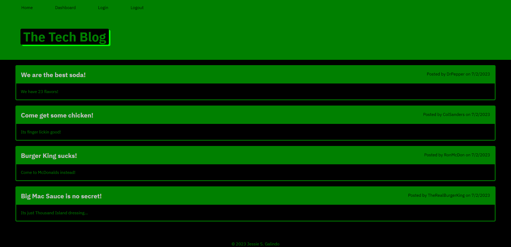

# Tech Blog

## Description

I was tasked with creating a working tech blog site that you can create a user, create posts, post comments on the posts, edit posts and comments, and delete posts.

## Installation

I used Node.js, Express.js, Mysql2, Sequelize, Handlebars, and bcrypt.

## Usage

When a user loads the page, they can login or signup. They then can read posts that are already posted and create new posts. They can create comments on the posts and delete their own posts and comments.

## Credits

Originally, I had attempted to do the code myself but it wasn't working so I had to get help from the solutions provided by the teacher and T.A.'s.

https://tech-blog-jg2023-1d9dc6a7613a.herokuapp.com/

https://github.com/MrMessyFace/tech-blog