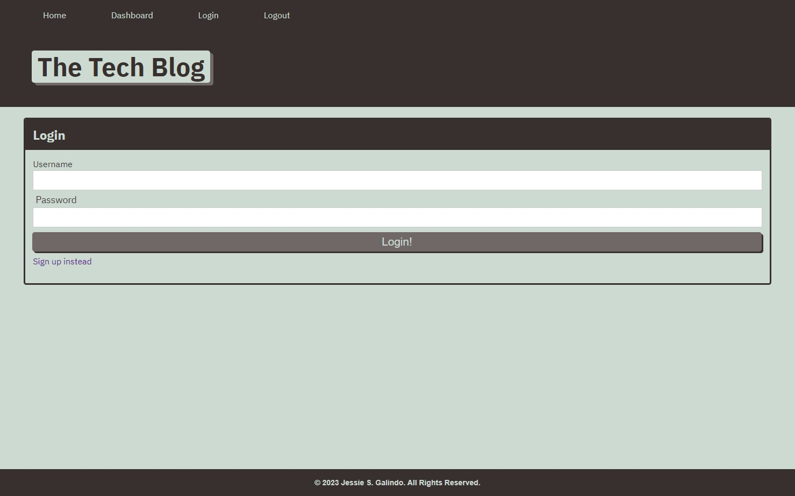

# Tech Blog

## Description

I was tasked with creating a working tech blog site that you can create a user, create posts, post comments on the posts, edit posts and comments, and delete posts. I used Node.js, Express.js, Mysql2, Sequelize, Express Handlebars, and Bcrypt. 

## Installation

No installation necessary but you can clone the [repository](https://github.com/MrMessyFace/tech-blog) from GitHub to edit it and make your own version. After you have cloned the repository, you would type "npm i" into the terminal to install the NPM packages. After the packages are installed, you would put your MySQL username and password into the .env.EXAMPLE file and change its name to just ".env". Then, you would type "npm start" into the terminal to start the server. You would then type "http://localhost:3001/" into your browser to view the app as you edit it.

## Usage

When a user loads the page, they can login or signup. They then can read posts that are already posted and create new posts. They can create comments on the posts and delete their own posts and comments.

## Credits

Originally, I had attempted to do the code myself but it wasn't working so I had to get help from the solutions provided by the instructional staff from the Northwestern University Full Stack Coding Bootcamp.

## Helpful Links

- [Repository](https://github.com/MrMessyFace/tech-blog)
- [Live App](https://tech-blog-jg2023-1d9dc6a7613a.herokuapp.com/)

&copy; 2023 Jessie S. Galindo. All Rights Reserved.
